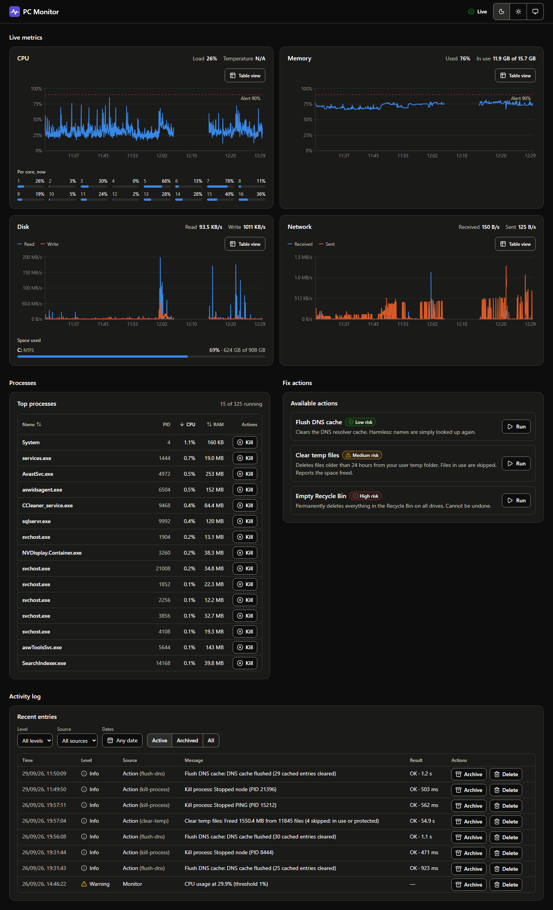
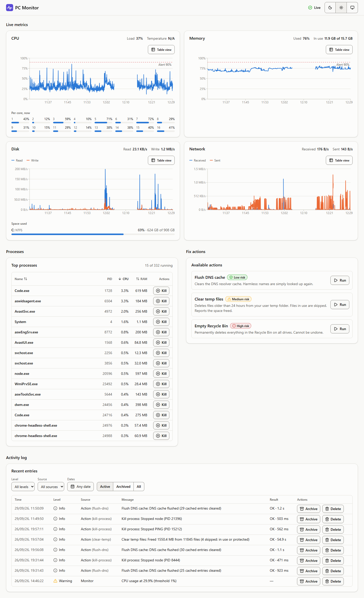
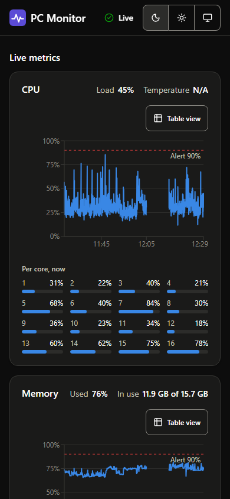

# PC Monitor

Live PC performance charts and one-click fix scripts, all running locally on your Windows machine.

<p>
  
</p>



<details>
<summary>Light theme and phone layout</summary>




</details>

## What it does

- **Monitor**: CPU (total, per core, temperature), RAM, disk usage and I/O, network throughput and a top-processes list (`GET /api/processes`); pushed live over Socket.IO (`/ws`) every 2 seconds and stored in SQLite, so the charts can be prefilled from `GET /api/metrics/history` and history survives restarts.
- **Fix**: PowerShell scripts run from the API: flush the DNS cache, clear temp files older than 24h, empty the Recycle Bin, kill a process. Emptying the Recycle Bin and killing a process need `{"confirm": true}`, enforced by the server (409 otherwise). The dashboard has a button per action and a Kill button per process, with a confirm dialog for the destructive ones and a toast with the result.
- **Log**: every action run (with success and duration) and every threshold alert is written to the log, which can be filtered (level, source, action, archived, date range) and paged; archiving and deleting entries needs the admin key. The dashboard shows the log with those filters, and a toast for each threshold alert as it happens.
- **Accessible**: keyboard-only use, screen-reader summaries and a table view for every chart, 44px touch targets, dark and light themes; checked with axe in unit tests and in a real browser (`npm run a11y -w frontend`).
- **Document**: every mounted endpoint is described in Swagger UI (`/api/docs`, spec at `/api/openapi.json`), generated from the same zod schemas used to validate requests; a test fails the build if a route is added without docs.

## Warning

This app runs local scripts that **modify your system**: it can terminate processes, delete the contents of your temp folders, flush the DNS cache and empty the Recycle Bin. Read the scripts under `backend/src/features/actions/scripts/` before running it. Some actions cannot be undone.

It is designed for your own machine only: the server binds to `127.0.0.1` and has no login. Do not expose it to a network.

## Architecture

npm workspaces monorepo, TypeScript strict everywhere, feature-based design in every package.

```
pc-monitor/
├── shared/     zod schemas + types shared by backend and frontend
├── backend/    Express 5 + Prisma/SQLite + Socket.IO
└── frontend/   React + Vite dashboard: live charts, process table, fix actions, activity log
```

Dependency direction: `app -> features -> core -> shared`. A feature only talks to another feature through its `index.ts`.

**One source of truth for types.** Schemas are defined once in `shared/` with zod. The backend uses them to validate requests and to generate the OpenAPI document, so the Swagger docs cannot drift from the code. The frontend derives its types from the same schemas and validates incoming Socket.IO events with them.

**Data flow**

1. A ticker collects a snapshot every 2 seconds with `systeminformation`.
2. The snapshot is broadcast over Socket.IO (`/ws`, event `snapshot`) and saved to SQLite. A threshold from `/api/config` exceeded for 3 cycles in a row writes a warning to the logs and sends an `alert` event (once per breach, at most every 5 minutes per metric).
3. The frontend loads recent history over REST, then appends live ticks.
4. A fix button calls `POST /api/actions/:id/run`. The server looks the id up in a fixed registry, runs the matching PowerShell script and records the result in the logs.

## Security model

There is no login, so the main threat is another website in your browser calling `localhost`. Defenses:

- server bound to `127.0.0.1` only, default port 4317
- strict CORS allow-list (only the frontend origin and the server's own origin, so Swagger UI's "Try it out" still works)
- requests that carry a body must be `Content-Type: application/json`, and a server-side `Origin` check independent of CORS rejects mismatched mutating requests with 403 — both close the "simple request" gap a plain HTML form could otherwise use
- `helmet` headers, Prisma-only database access, constant-time comparison for the (defense-in-depth) admin guard
- `Origin` check on the Socket.IO handshake too (CORS doesn't cover WebSockets), WebSocket transport only (no long-polling endpoints)
- Scripts started with `spawn` and an argument array in PowerShell `-File` mode (never a shell string), with a timeout that kills the whole process tree; action ids are only registry keys, never part of a path
- Server-side `confirm: true` for destructive actions; PIDs 0 and 4, the server itself and its parent are refused, and the kill script also refuses critical Windows processes (csrss, lsass, ...)
- `clear-temp` only deletes items older than 24h in your user temp folder and never follows junctions or symlinks

Cloning this repo and running it only ever affects the machine it runs on. Checked end to end: a page on a foreign origin cannot trigger an action (the browser blocks it, and a forged `Origin` gets 403 from the server before anything runs).

## Getting started

Requirements: Windows with PowerShell, Node.js 22+.

1. Clone and install (one `npm install` covers all three packages):

   ```bash
   git clone https://github.com/EliaGiolli/Performonitoring.git
   cd Performonitoring
   npm install
   ```

2. Configure the backend: copy `backend/.env.example` to `backend/.env` and set `API_SEGRETO` to a value of your own (the admin key for archiving and deleting log entries). The defaults for the rest work as they are: port `4317`, frontend origin `http://localhost:5173`, 7 days of retention.

3. Create the database (from `backend/`):

   ```bash
   npx prisma generate
   npx prisma migrate deploy
   ```

   Default alert thresholds are seeded when the server starts; samples and logs older than `RETENTION_DAYS` are pruned at startup.

4. Run it from the repo root and open **http://localhost:5173**:

   ```bash
   npm run dev
   ```

   The charts fill from the last hour of stored samples, then move live every 2 seconds. The first time you archive or delete a log entry, the dashboard asks for the `API_SEGRETO` value and remembers it for that browser tab.

API docs are at http://127.0.0.1:4317/api/docs while the backend runs.

### Commands

| Command (repo root) | What it does |
|---|---|
| `npm run dev` | shared (watch), backend and frontend together; the dashboard is on http://localhost:5173 |
| `npm test` | builds shared, then runs every workspace's tests |
| `npm run lint` | ESLint (typescript-eslint, React hooks, jsx-a11y) on every workspace |
| `npm run typecheck` | `tsc --noEmit` in every workspace |
| `npm run build -w frontend` | type-checks and builds the dashboard to `frontend/dist` |
| `npm run a11y -w frontend` | axe accessibility scan of the running app in a real browser (needs `npm run dev`) |
| `npm run live -w backend` | prints the live Socket.IO stream of a running backend |

See [backend/README.md](backend/README.md) and [frontend/README.md](frontend/README.md) for package details.
